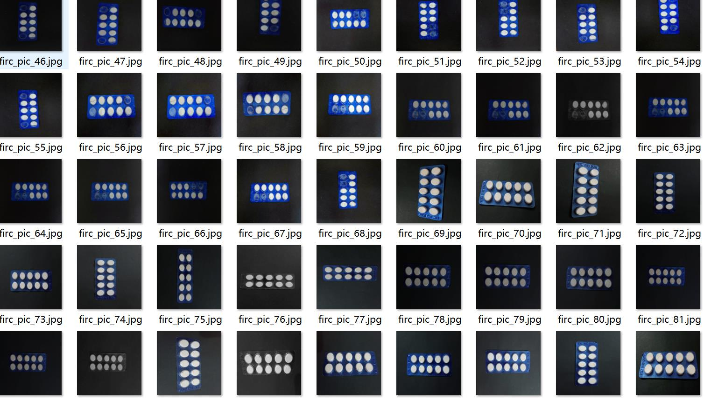
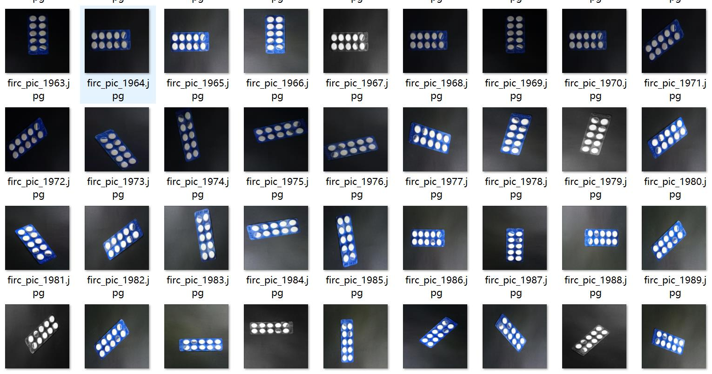
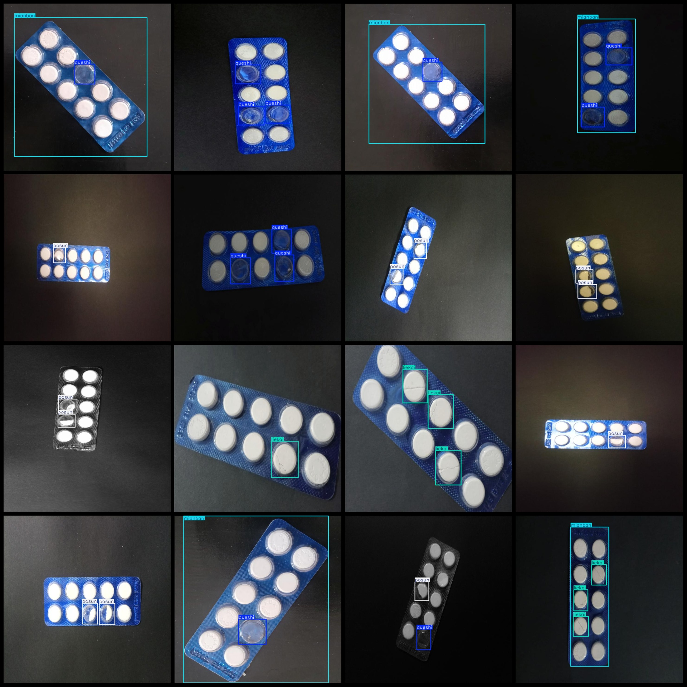
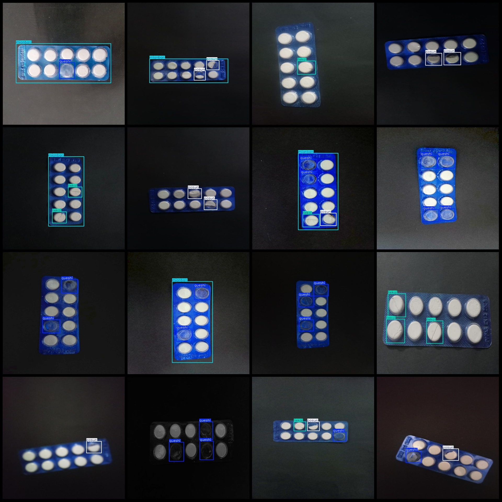

# Smart Medical Bottle Cap and Tab Defect Detection Dataset (VOC+YOLO format, 2375 images, 4 categories)

Note: Approximately 850 images are original images, with the remaining being enhanced images.
The dataset is in Pascal VOC format + YOLO format (excluding the segmentation path's txt file, only containing JPG images along with corresponding VOC format xml files and YOLO format txt files).
Number of images (JPG file count): 2375
Number of annotations (xml file count): 2375
Number of annotations (txt file count): 2375
Number of annotation categories: 4
Annotation category names (note that the order of yolo format categories does not correspond to this, but refer to the labels folder's classes.txt for consistency): ["liekai", "mianban", "posun", 
"queshi"]
Each category has the number of bounding boxes:
- Liekai (Cracked) bounding box count = 1679, occupying images = 1052
- Mianban (Panel) bounding box count = 1177, occupying images = 1176
- Posun (Damaged) bounding box count = 1259, occupying images = 941
- Queshi (Missing) bounding box count = 1803, occupying images = 842
Total bounding box count: 5918
Image resolution: 720x720
Annotation tool used: labelImg
Annotation rules: drawing a bounding box around the category
Important note: The dataset does not include a training/validation/test split, so it must be manually divided.
Special declaration: This dataset does not guarantee any accuracy on the trained models or weight files.
Image preview:
Annotation example:

## Image

Here is a pay link on Stripe ( https://buy.stripe.com/3cs8yP7sY87d0vu9AB ). Please contact me lonlonago@foxmail.com after funding $89, and I will send you a complete data files , thank you!

